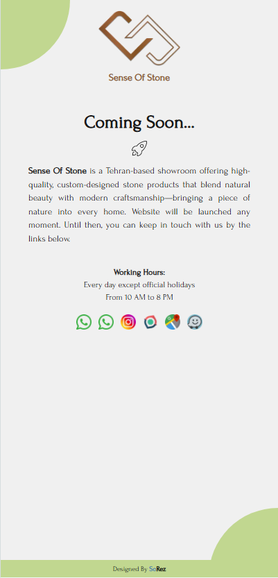

# 🪨 Sense of Stone - Coming Soon Page

This is the official **Coming Soon** page for the brand **Sense of Stone** — a creative design studio focused on premium stone-based furniture, architecture, and art.

🔗 **Live Preview**: [https://www.senseofstone.co/](https://www.senseofstone.co/)

---

## 📌 Purpose

The current page serves as a temporary landing page until the full website is launched. It provides visitors with:

- 📝 Brand introduction
- 📞 Contact information
- 📍 Physical address
- 📧 Email and social media links

---

## ✨ Features

- ✅ Clean and minimal UI
- 📱 Responsive layout for all devices
- 🌐 SEO-ready meta tags
- 🚀 Fast performance (static hosting)
- 📞 Easy access to contact and collaboration channels

---


## 🖼️ Screenshots

> A preview of the current landing page:


*Desktop view*



*Mobile view*

---

## 📦 Installation & Development (if modifying)

```bash
# Clone the repo
git clone https://github.com/your-username/sense_of_stone.git
cd sense-of-stone-coming-soon

# Install dependencies
npm install

# Run locally
npm run dev
```

## 🚧 Status
This is a temporary landing page.
Full website launch coming soon — stay tuned!
